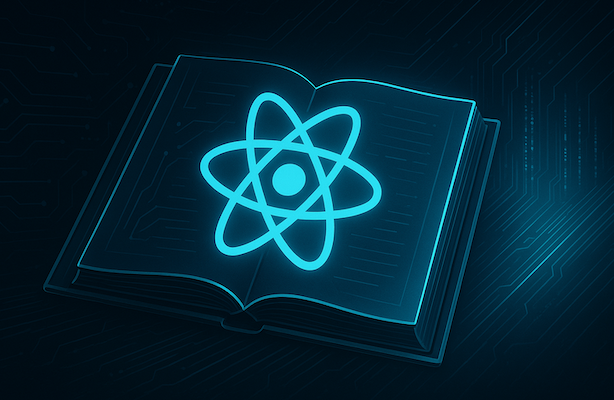
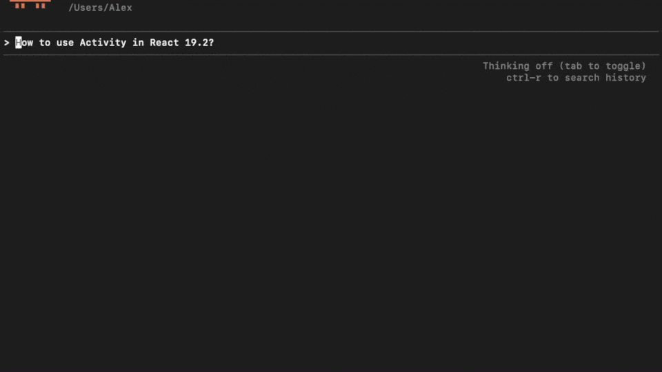

<p align="center">
  
</p>

# React Docs MCP Server

AI-powered semantic search over React documentation for Claude, Cursor, and other MCP clients.

<p align="center">
  
</p>

## 🚀 Installation (One Command)

### Claude Code

```bash
claude mcp add --transport stdio react-docs -- npx react-docs-mcp
```

### Claude Desktop

Edit: `~/Library/Application Support/Claude/claude_desktop_config.json` (macOS) or `%APPDATA%\Claude\claude_desktop_config.json` (Windows)

```json
{
  "mcpServers": {
    "react-docs": {
      "command": "npx",
      "args": ["-y", "react-docs-mcp"]
    }
  }
}
```

### Cursor

**Settings** → **Cursor settings** → **Tools and MCP** → Add server:

```json
{
  "mcpServers": {
    "react-docs": {
      "command": "npx",
      "args": ["-y", "react-docs-mcp"]
    }
  }
}
```

**That's it!** Restart your editor and ask about React.

---

## Features

- **🔍 Semantic Search**: AI-powered search using embeddings for conceptual matches
- **⚡ Fast Results**: In-memory vector search with hybrid keyword+semantic ranking
- **📦 Zero Config**: Works with `npx` - no installation needed
- **🤖 Local AI**: Runs embeddings locally (no API costs)
- **📝 Concise Responses**: Returns summaries instead of full documentation
- **🔄 Auto-sync**: Pulls latest docs from react.dev automatically

## Configuration

### For Claude Desktop

Add to your Claude Desktop configuration file:

**macOS**: `~/Library/Application Support/Claude/claude_desktop_config.json`
**Windows**: `%APPDATA%\Claude\claude_desktop_config.json`

```json
{
  "mcpServers": {
    "react-docs": {
      "command": "node",
      "args": ["/absolute/path/to/reactDocsMcp/dist/index.js"]
    }
  }
}
```

### For Claude Code

Add to your MCP settings configuration:

```json
{
  "mcpServers": {
    "react-docs": {
      "command": "node",
      "args": ["/absolute/path/to/reactDocsMcp/dist/index.js"]
    }
  }
}
```

## Usage

Once configured, the server provides the following capabilities to AI agents:

### Tools

#### `search_react_docs`

Search across React documentation.

**Parameters**:

- `query` (required): Search query string
- `section` (optional): Filter by section (learn, reference, blog, community)
- `limit` (optional): Maximum number of results (default: 10, max: 50)

**Example**:

```
Search for "useState hook" in the learn section
```

#### `get_doc`

Get a specific documentation page.

**Parameters**:

- `path` (required): Document path (e.g., "learn/hooks/useState")

**Example**:

```
Get the useState documentation
```

#### `list_sections`

List all available documentation sections.

**Example**:

```
What sections are available?
```

#### `update_docs`

Pull latest documentation from the Git repository.

**Example**:

```
Update the React documentation
```

### Resources

The server exposes documentation as resources with the URI pattern:

```
react-docs://{section}/{path}
```

**Examples**:

- `react-docs://learn` - List all learn section docs
- `react-docs://learn/hooks/useState` - Get useState documentation
- `react-docs://reference/react/Component` - Get Component API reference

## Development

### Run in Development Mode

```bash
npm run dev
```

### Build

```bash
npm run build
```

### Project Structure

```
reactDocsMcp/
├── src/
│   ├── index.ts              # MCP server entry point
│   ├── docsManager.ts        # Git & file operations
│   ├── markdownParser.ts     # Markdown parsing
│   ├── searchEngine.ts       # Search implementation
│   ├── types.ts              # TypeScript types
│   └── config.ts             # Configuration
├── dist/                     # Compiled output
└── TECHNICAL_SPEC.md         # Technical documentation
```

## How It Works

1. **Initialization**: On first run, clones the official React documentation repository
2. **Indexing**: Parses all markdown files and builds an in-memory search index
3. **Search**: Provides keyword-based search with relevance scoring
4. **Updates**: Can pull latest changes from the repository and re-index

## Troubleshooting

### Server won't start

- Ensure Node.js 18+ is installed
- Check that the build completed successfully (`npm run build`)
- Verify the path in your MCP configuration is absolute and correct

### No search results

- The repository may still be cloning (check console output)
- Try running `update_docs` tool to refresh the index

### Git clone fails

- Check internet connection
- Verify Git is installed and accessible
- Check firewall/proxy settings

## Technical Details

For detailed technical information, see [TECHNICAL_SPEC.md](./TECHNICAL_SPEC.md).

## License

MIT

## Contributing

This is a personal project for connecting React documentation to AI coding agents. Feel free to fork and modify for your own use.
